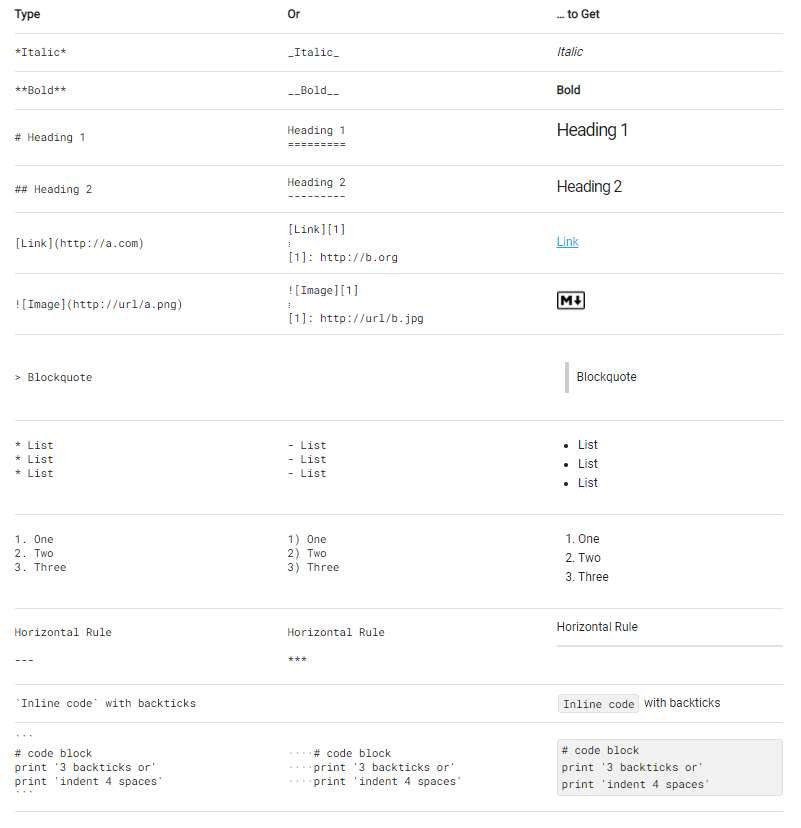

## Шпаргалка Markdown

**Списки дел:**
- [X] Выполненная задача
- [ ] Невыполненная задача
- [ ] Невыполненная задача

**Содержание:** [TOC]

**~~Зачёркнутый текст.~~**

**Таблицы:**
| Tables        | Are           | Cool  |
| ------------- |:-------------:| -----:|
| col 3 is      | right-aligned | $1600 |
| col 2 is      | centered      |   $12 |
| zebra stripes | are neat      |    $1 |

**Эмодзи:** :kissing_heart:

